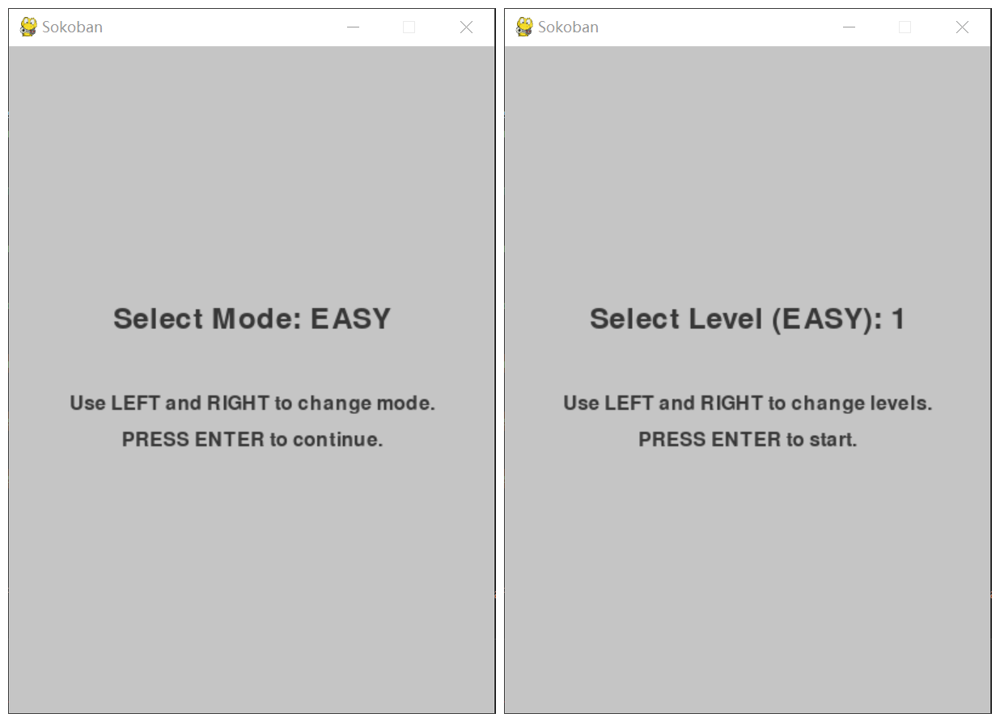
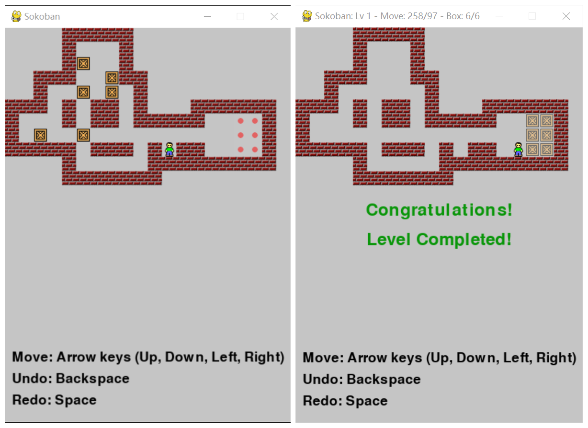

# Final Project: Sokoban Game
This is the final project of the course Software Carpentry. This project implements a Sokoban game with two difficulty levels and includes a solver that can use various search algorithms to solve the puzzles automatically.

## Features
- **Interactive Game Play**: Play Sokoban with intuitive controls and navigate through different levels.
- **Two Modes of Difficulty**: Includes an 'easy' mode and a 'hard' mode with different levels designed for a range of skills.
- **Solver Algorithms**: Features several search algorithms, including Breadth-First Search (BFS), Depth-First Search (DFS), A* Search, and Uniform Cost Search to solve the puzzles automatically.

## Getting Started

### Prerequisites
- Python 3.6 or higher
- NumPy library
- Pygame library (for running the interactive game)

### Installation
1. Clone the repository

```git clone https://github.com/keyi-chai/Final-Project-Sokoban-Game.git```

2. Navigate to the cloned directory:
```cd Final-Project-Sokoban-Game```

4. Install the required Python libraries:
pip install numpy pygame
5. Running the Sokoban game
python sokoban.py
6. Running the solver after choosing levels and methods
python solver.py

## Game Demonstration

### Level Setting
With the following table, you may customize your own map in a txt file and add it to the levels.

| Map Element   | Characters | Number in Solver |
|---------------|------------|------------------|
| Empty space   | ' ' or '-' | 0                |
| Wall          | '#'        | 1                |
| Man           | '@'        | 2                |
| Box           | '$'        | 3                |
| Target        | '.'        | 4                |
| Box on Target | '*'        | 5                |
| Man on Target | '+'        | to be developed  |

One typical map looks like this:
```  
   ########
   #   #  ##
  ##  $  $ ##
 ##  * # .$ ##
##  *  ## .$ ##
#  * ##### .$ #
# + ##   ## . #
#####     #####
```

### Users Interface
Users are allowed to choose the mode and level number when the game initializes


The game interface applies the classic Sokoban game style. Player's are able to play following the instructions

The title shows the level number, moves(Total Moves/Moves of Boxes) and boxes(Boxes on Targets/Total Boxes)

There will be a congratulation message when you complete the level

## Solver Demonstration

### Algorithms
This project implements several pathfinding algorithms to solve the Sokoban puzzles:

- **Breadth-First Search (BFS)**: Explores the nearest nodes first; guarantees the shortest path in an unweighted grid.
- **Depth-First Search (DFS)**: Explores as far as possible along each branch before backtracking.
- **Uniform Cost Search (UCS)**: Expands the least cost node first.
- **Astar Search**: Uses heuristics to estimate the cheapest path to the goal.

In general, Astar and BFS show better performance, while DFS solution usually includes redundant moves.

### Usage
In the main function of solver.py, you may change the method and level you want to analyze. Complicated maps are not recommended.

### Output Explanation
The output is a string showing the moves of the player. The 'u' for up, 'd' for down, 'l' for left and 'r' for right. The capitalized letters represent moves of boxes.
The output also include information on the time of the selected method.

## Future Work
- Add transitions between levels so that users can play the game continuously
- Solver for situation where man starts on a target
- Solver for complex maps

## Project Structure
- `sokoban.py`: Main game file to run the Sokoban game.
- `solver.py`: Contains the solver logic and different search algorithms.
- `easy/`: Directory containing easy level designs.
- `hard/`: Directory containing hard level designs.
- `README.md`: This file.

## Credits and Acknowledgments

This project has been enriched and made possible by the following external resources:

### Level Maps and Icons
I have utilized level maps and skin icons from the following project:
- [pySokoban](https://github.com/kazantzakis-zz/pySokoban.git) by kazantzakis-zz. This project provided a rich set of pre-designed level maps for implementation and testing of solver.

### Pruning Strategy
The efficient pruning strategy employed in our solver was inspired by the approach used in:
- [Sokoban Solver](https://github.com/KnightofLuna/sokoban-solver.git) by KnightofLuna. This strategy has greatly improved the performance of the puzzle-solving algorithms by reducing the search space and eliminating non-viable paths early in the computation process.

I am grateful to the developers of these projects for their innovative work and contributions to the open-source community, which have greatly aided in the development of this Sokoban game.

